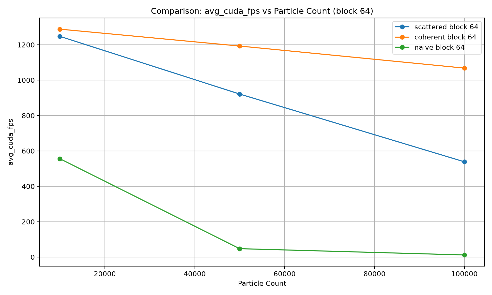
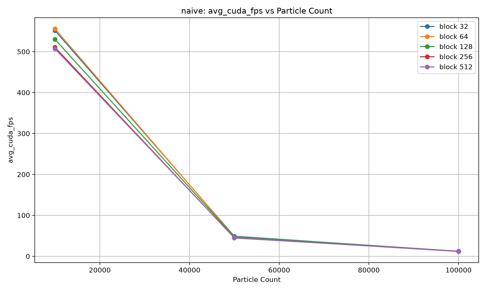
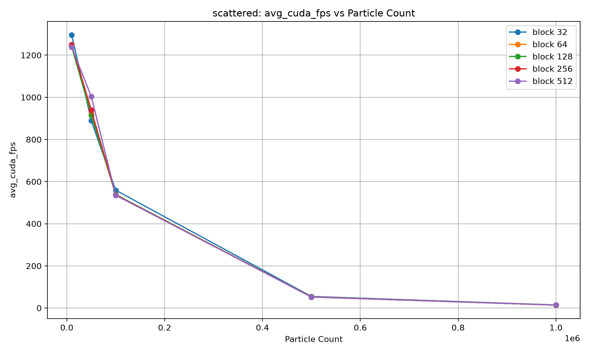
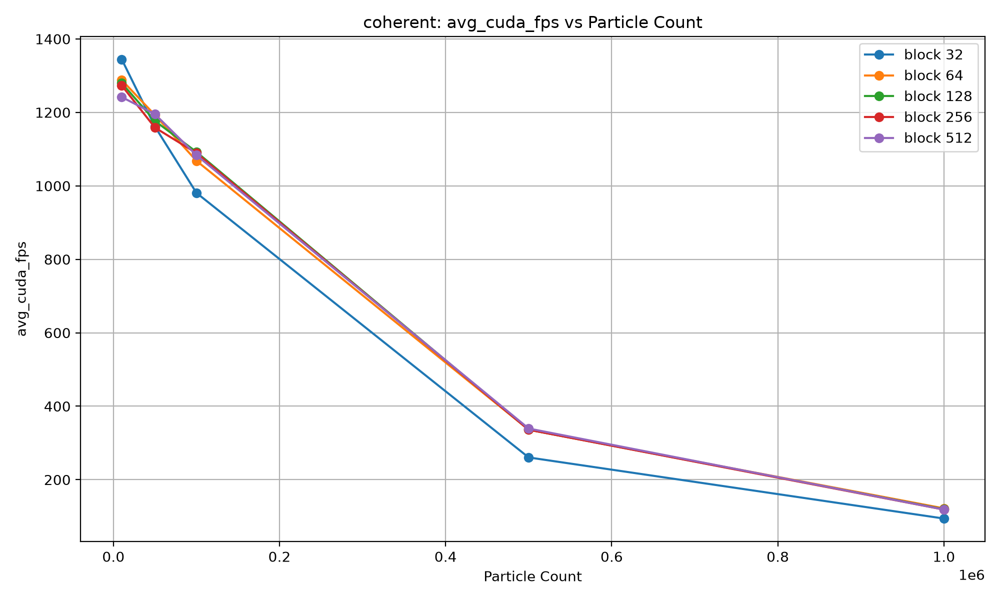
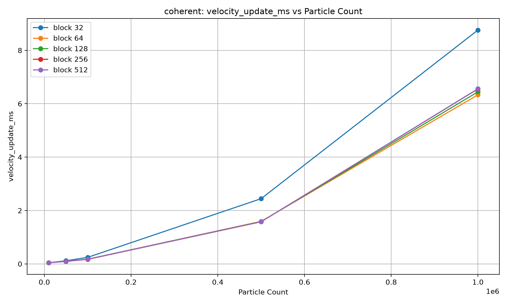

**University of Pennsylvania, CIS 5650: GPU Programming and Architecture,
Project 1 - Flocking**

Thomas Lee
[https://www.linkedin.com/in/thomas-lee-6353b5253/](), [https://thomaslee03-github-io.vercel.app/]()

* Tested on: Windows 11, AMD Ryzen 9 7845HX @ 3.00 GHz, 64GB RAM, NVIDIA GeForce RTX 4070 Laptop GPU 8GB. Personal laptop. 

## Introduction

This project implements and compares several CUDA-based approaches for simulating a flock of boids. Each boid follows the standard flocking rules of cohesion, separation, and alignment, where its velocity is updated based on nearby boids and its position is then advanced using the updated velocity. The main goal of the project is to explore how different GPU data structures and memory-access patterns affect the performance of the simulation as the number of boids and CUDA launch configuration change.

The project includes three implementations: a naive brute-force approach, a scattered uniform-grid approach, and a coherent uniform-grid approach.

**Naive**

The naive implementation performs a brute-force neighbor search. For every boid, the velocity-update kernel checks every other boid in the simulation to determine whether it falls within the distance required for the cohesion, separation, or alignment rules. This means that each simulation step requires every boid to compare itself against all other boids, resulting in roughly (O(N^2)) work as the number of boids increases.

**Scattered Uniform Grid**

The scattered uniform-grid implementation accelerates neighbor searching by dividing the simulation space into a 3D grid. Each boid is assigned to a grid cell based on its position, and the boids are sorted by their grid-cell index. Start and end indices are then recorded for each occupied cell so that, during the velocity update, a boid only needs to search the nearby grid cells that could contain relevant neighbors rather than checking every boid in the simulation.

  

Although the boids are sorted by grid-cell index, the actual position and velocity arrays are not reordered. Instead, the sorted array stores indices that point back into the original position and velocity arrays. As a result, neighboring boids in the grid may still be located far apart in memory, so accessing them during the velocity update can involve scattered memory accesses.

**Coherent Uniform Grid**

The coherent uniform-grid implementation uses the same grid construction and sorting process, but additionally rearranges the boid position and velocity data according to the sorted particle indices. After sorting the boids by grid cell, the implementation copies their positions and velocities into coherent arrays so that boids belonging to the same or nearby grid cells are stored near each other in memory.

The velocity update can then operate directly on these reordered arrays instead of repeatedly following indices back into the original scattered arrays. This removes a level of indirection and is intended to improve memory locality and GPU memory-access efficiency. After the simulation step completes, the coherent buffers are swapped appropriately so that the reordered data becomes the current simulation state.

## Benchmarking Methodology

All performance tests were run in Release mode on the RTX 4070 Laptop GPU listed above with visualization disabled. Each configuration was allowed 100 warm-up frames before collecting timing data over the following 1000 simulation steps. CUDA events were used to measure both total simulation time and individual kernel execution times.

We tested block sizes of 32, 64, 128, 256, and 512 threads across multiple boid counts. Because the implementation launches enough blocks to cover all boids, block count is determined by the number of boids and selected block size.

## Performance Analysis

**Direct Comparison**

We begin with a direct comparison between the naive, scattered, and coherent uniform-grid implementations. Across all block dimensions tested (32, 64, 128, 256, and 512), the coherent implementation consistently achieved the highest average FPS, followed by the scattered implementation, while the naive implementation performed the worst. The figure below shows this comparison using a block size of 64.

  

At higher particle counts, the naive implementation approaches very low FPS, causing the curve to appear to flatten near the bottom of the graph. A similar trend can also be observed for the scattered and coherent implementations when the particle count is increased further. However, because the naive implementation became prohibitively slow at these larger particle counts, we did not collect naive results over the same extended range.

  

Overall, the uniform-grid implementations scale significantly better with increasing particle count than the naive implementation because they reduce the number of boids that must be considered during each neighbor search. Between the two grid-based approaches, the coherent implementation provided the best performance, suggesting that reorganizing the boid data into a more coherent memory layout provided an additional performance benefit over retaining the original scattered layout.

**Effect of Changing Block Dimensions**

We also examined how changing CUDA block dimensions affected overall simulation performance. For the scattered and naive implementation, varying the block size resulted in little to no noticeable difference in average FPS.

  

  

For the coherent implementation, however, block size 32 consistently produced lower FPS than the other tested block sizes. The figure below shows the average FPS for each particle count while varying the block dimension.

  

Overall, block sizes of 64, 128, 256, and 512 performed relatively similarly, while a block size of 32 was noticeably worse for the coherent implementation.

**Kernel-Specific Performance**

Although changing the block dimensions had little effect on the overall FPS of the scattered implementation, examining individual kernel timings revealed more noticeable differences.

  

For the kernel responsible for computing particle grid indices, performance varied with block size. Block sizes of 128, 256, and 512 produced the lowest execution times, while block size 64 was somewhat slower and block size 32 produced the highest execution time.

A similar pattern can be seen in the kernel responsible for identifying the start and end indices of occupied grid cells.

  

These trends were also present in the coherent implementation.

  

  

Another notable result appeared in the coherent implementation's position and velocity update kernels. In both cases, a block size of 32 resulted in the highest execution time.

  

  

The scattered implementation showed less variation in these kernels. Position-update performance remained relatively similar across block dimensions, while the velocity-update kernel showed a small decrease in execution time for some of the block size of 32.

  

## Reasoning for our results

**Naive vs. Uniform Grid**

The naive implementation performs a brute-force neighbor search, where every boid checks every other boid. This causes the amount of work to grow quickly as the number of boids increases. In contrast, the uniform-grid implementations limit the neighbor search to nearby grid cells, which reduces the number of comparisons and explains why they perform much better at larger particle counts.

**Coherent vs. Scattered**

The coherent implementation performed better than the scattered implementation mainly because of improved memory access. In the scattered version, the sorted particle indices still point back to the original position and velocity arrays, which can result in non-contiguous memory accesses. The coherent version instead rearranges the boid data so that nearby boids are stored closer together in memory. Although this requires an extra reordering step, the improved memory locality during the neighbor search appears to outweigh that cost.

**Effects of Block Dimensions**

Changing the block dimension changes how threads are grouped and scheduled on the GPU. In our implementation, changing the block size also changes the number of blocks launched. We observed that block size 32 often resulted in slower kernel execution, especially for the coherent implementation, while larger block sizes generally performed better.

However, increasing block size did not always continue to improve performance. This is because GPU performance depends on balancing the number of threads per block with the number of blocks that can run in parallel. This also explains why some individual kernels showed noticeable timing differences while the overall FPS changed only slightly.
